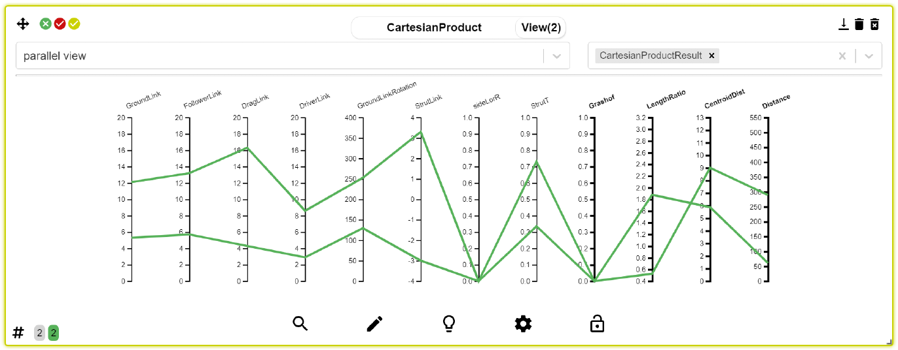
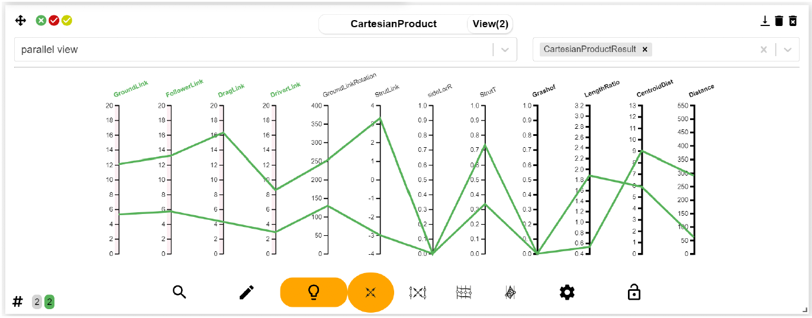
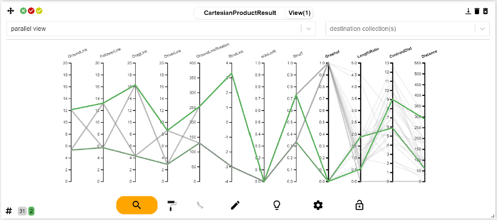

# Cartesian Product

***

The **Cartesian Product** produces alternatives by taking every combination of input
parameters from two or more alternatives. It grows explosively (with n alternatives
and k parameters, it produces nk+1 alternatives if all parameter values are distinct for
each alternative. The +1 in k + 1 indicates that the product applies each combination
to the model of each alternative. If the models are the same, the Cartesian Product
produces nk alternatives. We limit the size of the product by restricting both n and k.
For instance, limiting n to 2 and k to 4 produces 32 alternatives. The Cartesian Product
tends to produce converging designs that do not radically differ from their arguments.

<figure>
    
    <figcaption>(a) Two alternatives selected</figcaption>
</figure>

<figure>
    
    <figcaption>(b) Coordinates selected for the Cartesian Product</figcaption>
</figure>

<figure>
    
    <figcaption>(c) Cartesian Product result</figcaption>
</figure>

The **Cartesian Product** produces alternatives by taking all combinations
of a set of input parameters from two or more alternatives. It produces a complete
graph between each adjacent pair of parallel coordinates. The figure shows the state
of the interface with two alternatives selected for the Cartesian Product, with four
coordinates selected for the product and the results (in another collection) with the
two original alternatives selected.
