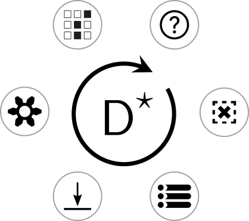
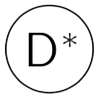

# Features and Interactions

D.Star's key features (e.g., one object - many views, two object types (collections and alternatives), large displays) make its user interface different from many other applications. 

## The D.Star Menu

D.Star is designed for large displays in which you choose where to
work on the display. Its menu thus floats: it is available wherever
your current focus lies. `Right-click` to access the main menu.

<!--- a comment --->

The main menu provides seven categories. Some categories are single commands.

  -- accesses the main D.Star interface; gives local project information

   -- deselects all collections and alternatives. This is frequently used.

  -- accesses these help pages
 
  -- accesses the `sink`, from where *sunk* collections can be restored.

  -- accesses the D.Star settings
 
  -- displays logs
 
  -- accesses a menu of commands on collections

## One object--many views: references and clones

D.Star provides multiple coordinated views of collections: a collection can be viewed as an image gallery and as a parallel coordinate system. Two views of the same collection are said to *reference* each other. It is also possible to have two collections that are identical but independent: such pairs are called *clones.* References and clones are produced by different versions of the usual *cut, copy* and *paste* commands.

## Projects

D.Star provides *projects.* Typically these comprise alternatives that have a common parametric model.  One project at a time may be open.

## Selection

D.Star has two distinct object types: collections and alternatives. Collections hold alternatives; they are the main organization tool in D.Star. D.Star maintains two distinct selection sets, one for collections and one for alternatives. It needs these because many commands require both a set of collections and a set of alternatives in their arguments.

D.Star is all about handling multiple alternatives, so the most frequent selection tasks involve selecting multiple objects. In D.Star, selection is cumulative by default. Clicking on an object adds it to the currently selected set of objects.

## Cut, copy and paste

### Collections

`CTRL-C` -- Copies the currently selected collections to the collections clipboard.

`CTRL-` -- Cuts the currently selected collections to the collections clipboard.

`CTRL-V` -- Pastes as a *reference* the contents of the collections clipboard.

`CTRL-B` -- Pastes as a *clone* the contents of the collections clipboard. The resulting collection is a clone, but the alternatives in it are references.

`CTRL-SHIFT-B' -- Pastes as a *deep clone* the contents of the collections clipboard. The resulting collection is a clone as are all of its alternatives. Both collection and alternatives are independent of other objects in the project.

### Alternatives

`ALT-C` -- Copies the currently selected alternatives to the alternatives clipboard.

`ALT-X` -- Cuts the currently selected alternatives to the alternatives clipboard.

`ALT-V` -- Pastes as a *reference* the contents of the alternatives clipboard. The paste operation applies to each of the currently selected collections. 

`ALT-B` -- Pastes as a *clone* the contents of the alternatives clipboard. The paste operation applies to each of the currently selected collections.

## cumulative selection

## universal selection

## View in 3D

## Messages & History

## Infinite Canvas

## Folder View

### Selecting

### View 3D Model

## Parallel View

### drag axis

### brushing

### Hovering

### Parallel Edit

### Free Sketch

### Toggle Dimension

### Cartesian Product

### Binary Query

### Sampling

## List View

### Search

### Order

### View Image

### View in 3D
